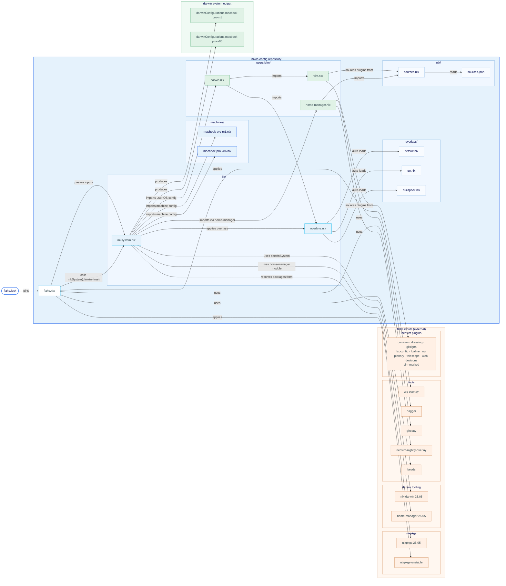

# Repository Architecture

This is a fork/adaptation of Mitchell Hashimoto's nixos-config, structured around a single flake that manages multiple machines across macOS, NixOS VMs, and WSL.

## Core Composition Model

`lib/mksystem.nix` is the central abstraction. It's a function that takes a machine name and `{ system, user, darwin, wsl }` and produces either a `darwinSystem` or `nixosSystem` by composing four layers:

```
flake.nix
  └─ mkSystem("macbook-pro-m1", { system="aarch64-darwin", user="slim", darwin=true })
       └─ mksystem.nix
            ├─ overlays (zig, gh/unstable, claude-code/unstable, secretspec/unstable)
            ├─ machines/macbook-pro-m1.nix     (hardware/machine specifics)
            ├─ users/slim/darwin.nix           (macOS OS-level config)
            └─ users/slim/home-manager.nix     (user packages + dotfiles)
```

## How nixpkgs Works on macOS

macOS doesn't run NixOS — there's no init system or service manager managed by Nix. Instead, **nix-darwin** (`github:nix-darwin/nix-darwin`) acts as the macOS equivalent, providing:

- A `darwin-rebuild switch` command analogous to `nixos-rebuild switch`
- Module system for macOS system configuration
- Integration points for Homebrew, system defaults, launchd services
- A `system` profile at `/run/current-system` (symlinked from `/nix/var/nix/profiles/system`)

The key distinction: `nix.useDaemon = true` in `darwin.nix` means nix-darwin does **not** manage the Nix daemon installation itself. The Nix daemon is installed separately (via Determinate Systems `nix-installer` or Flox) before nix-darwin is ever invoked.

Homebrew is also managed declaratively from `darwin.nix` — casks (`ghostty`, `google-chrome`, `1password`, etc.) and brews (`gh`, `pinentry-mac`, `opencode`, etc.) are specified there, and nix-darwin runs `brew` during activation to reconcile them.

## Bootstrapping a New macOS Host

1. **Install Nix** (with flakes): Use [Determinate Systems nix-installer](https://github.com/DeterminateSystems/nix-installer) or Flox. This installs the Nix daemon and creates `/nix`.

2. **Clone the repo** and run:
   ```bash
   NIXNAME=macbook-pro-m1 make
   ```

3. `make switch` on Darwin runs:
   ```bash
   # Step 1: Build the system closure
   NIXPKGS_ALLOW_UNFREE=1 nix build --impure \
     --experimental-features "nix-command flakes" \
     ".#darwinConfigurations.macbook-pro-m1.system"

   # Step 2: Activate it
   sudo NIXPKGS_ALLOW_UNFREE=1 \
     ./result/sw/bin/darwin-rebuild switch --impure \
     --flake "$(pwd)#macbook-pro-m1"
   ```

   `darwin-rebuild` is bootstrapped from the build result itself (`./result/sw/bin/darwin-rebuild`) — you don't need it pre-installed. This is how the first activation works before nix-darwin is on PATH.

## How the Environment Becomes Active: The PATH Story

There are four distinct PATH layers that compose the final shell environment.

### Layer 1: Nix daemon bootstrap (one-time, from nix-installer)

The Determinate Systems installer creates `/etc/zshrc.d/nix.sh` (or patches `/etc/zshenv`) that sources:
```
/nix/var/nix/profiles/default/etc/profile.d/nix-daemon.sh
```
This puts the `nix` CLI itself on PATH (`/nix/var/nix/profiles/default/bin`). This layer runs before any nix-darwin or home-manager config.

### Layer 2: nix-darwin system activation

When `darwin-rebuild switch` runs, it:
- Builds the full system closure into `/nix/store/...`
- Creates `/run/current-system` pointing to that store path
- Creates `/run/current-system/sw` as an aggregated view of all system packages
- Patches `/etc/zshrc` and `/etc/bashrc` to source the nix-darwin shell setup

This puts `/run/current-system/sw/bin` on PATH, making all `environment.systemPackages` available.

### Layer 3: home-manager user packages

With `home-manager.useUserPackages = true`, home-manager installs packages into:
```
/nix/var/nix/profiles/per-user/slim/profile
```
And symlinks it as `~/.nix-profile`. The home-manager activation (run during `darwin-rebuild switch`) prepends `~/.nix-profile/bin` to PATH.

### Layer 4: bashrc (manual additions)

`users/slim/bashrc` (written to `~/.bashrc` by home-manager via `programs.bash.initExtra`) adds:
```bash
export PATH=~/go/bin:~/.local/bin/:/opt/homebrew/bin:$PATH
```
This handles Go binaries, local scripts, and Homebrew's prefix (`/opt/homebrew/bin` on Apple Silicon).

### Full PATH at runtime (conceptual order)

```
~/go/bin
~/.local/bin
/opt/homebrew/bin                      <- Homebrew packages (pinentry-mac, opencode, etc.)
~/.nix-profile/bin                     <- home-manager packages (fzf, ripgrep, nvim, etc.)
/run/current-system/sw/bin             <- nix-darwin system packages
/nix/var/nix/profiles/default/bin      <- nix CLI itself
/usr/local/bin, /usr/bin, /bin         <- macOS base system
```

### Key activation files (written by nix-darwin into `/etc`)

| File | Purpose |
|---|---|
| `/etc/bashrc` | Sourced by bash; sets up Nix environment |
| `/etc/zshrc` | Sourced by zsh; same |
| `/etc/static/` | Symlinked from the Nix store; actual content of nix-darwin-managed `/etc` files |
| `/run/current-system` | Symlink to the active system generation |

## The Two-Track Package System

| Mechanism | Where packages live | Activated by |
|---|---|---|
| Nix / home-manager | `/nix/store`, linked via `~/.nix-profile` | Shell rc files patched by nix-darwin |
| Homebrew (declarative) | `/opt/homebrew` | Managed by nix-darwin's homebrew module, always on PATH via bashrc |

The design uses both because some macOS GUI apps (`.app` bundles) and certain tools with macOS-specific requirements work better via Homebrew casks, while the bulk of the CLI development environment is managed purely through nixpkgs.

## Darwin Build Graph


